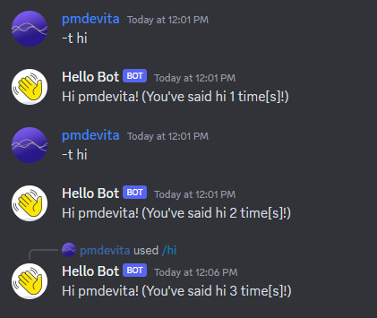

# hikari-atsume

[](https://github.com/pmdevita/hikari-atsume/actions/workflows/ci.yml)
[](https://pmdevita.github.io/hikari-atsume/)


[Documentation](https://pmdevita.github.io/hikari-atsume/)

An opinionated Discord bot framework inspired by Django and built on 
top of [Hikari](https://github.com/hikari-py/hikari), [Tanjun](https://github.com/FasterSpeeding/Tanjun), 
[Ormar](https://github.com/collerek/ormar), and [Alembic](https://alembic.sqlalchemy.org/en/latest/).

Atsume is in alpha and breaking changes should be expected. If you have any feedback or advice, feel free 
to find me in the [Hikari Discord](https://discord.gg/Jx4cNGG).


## Features

- Automatic project scaffolding/file-based organization
- Configuration instead of boilerplate
- Functionality split into modular, independent components
- Automatically restart the bot on changes during development
- Configure which components run in which servers
- Database ORM with Ormar
- Automatic database migrations with Alembic

## Quick Start

### Installation

Create a new project directory and install hikari-atsume 
(make sure you are using Python 3.10+. If you are using Poetry, 
your Python dependency should be `python = "^3.10,<3.12"`)

```shell
# Install with your preferred database backend, SQLite recommended for beginners

pip install hikari-atsume[sqlite]

pip install hikari-atsume[mysql]

pip install hikari-atsume[postgresql]
```

### Start a new project

Now to start your new project, run 

```shell
atsume startproject my_bot
```

which should generate some files for your project. In `my_bot/local.py`, add your
Discord bot token in. If you want to use message commands, make sure to set your 
`MESSAGE_PREFIX` and add `hikari.Intents.MESSAGE_CONTENT` to your `INTENTS`.

```python
# my_bot/settings.py

INTENTS = hikari.Intents.ALL_UNPRIVILEGED | hikari.Intents.MESSAGE_CONTENT
```

### Start a component

In your project directory run

```shell
python manage.py startapp basic
```
which should generate a new directory called `basic`.

In `basic/commands.py`, write your commands using [Tanjun](https://tanjun.cursed.solutions/usage/#declaring-commands).
Commands are declared without explicitly attaching to a Component object 
(Atsume takes care of that using `load_from_scope`).

This is an example of a hybrid slash/message command that takes one 
optional positional argument, the user to say hi to.

```python
# basic/commands.py

@tanjun.annotations.with_annotated_args(follow_wrapped=True)
@tanjun.as_message_command("hi", "hello", "hey", "howdy")
@tanjun.as_slash_command("hi", "The bot says hi.")
async def hello(
    ctx: atsume.Context,
    member: Annotated[Optional[Member], "The user to say hi to.", Positional()] = None,
) -> None:
    member = member if member else ctx.member
    if member:
        await ctx.respond(f"Hi {member.display_name}!")
```

Now with our new component ready, register it in the bot's settings.

```python
# my_bot/settings.py

COMPONENTS = [
  "basic"
]

```

### Working with the database

Let's say we want to track how many times each member of a guild has said 
hi to the bot. In our `models.py` file, let's create a new database model 
to keep track of this. Atsume uses [Ormar](https://collerek.github.io/ormar/)
for its database models and queries.

```python
# basic/models.py
from atsume.db import Model
import ormar

class HiCounter(Model):
  user: int = ormar.BigInteger(primary_key=True)  # Discord User IDs need to be stored as big integers
  count: int = ormar.Integer(default=0)

```

Now in our `commands.py`, let's increment a user's count every time they say hi.

```python
# basic/models.py

# Skipping the decorators
async def hello(
    ctx: atsume.Context,
    member: Annotated[Optional[Member], "The user to say hi to.", Positional()] = None,
) -> None:
    member = member if member else ctx.member
    if member:
        count_model, _ = await HiCounter.objects.get_or_create(user=member.user.id, _defaults={"count": 0})
        count_model.count = count_model.count + 1
        await count_model.upsert()
        await ctx.respond(f"Hi {member.display_name}! (You've said hi {count_model.count} time[s]!)")
```

### Migrating the database

Before we run this though, we need to add our HiCounter model to the database! To do this, 
we can generate a database migration that will migrate the database from it's current 
state (nothing) to the state we want (a database with a table for HiCounter). Atsume 
can generate migrations automatically in most cases so we'll use it's tool for that here.

Run this command to generate migrations.

```shell
python manage.py makemigrations
```

You should see something like

```
Migrating ComponentConfig(name"basic")...
  Create model hicounter...
```

Once that's done, your migration is ready to go! Run it on the database with 

```shell
python manage.py upgrade
```

#### Note about Atsume Migrations

Atsume's migrations are still very much a work in progress (you can track it 
[here](https://github.com/pmdevita/hikari-atsume/issues/2)).
As a general rule of thumb, Atsume is good at migrations that create and delete 
models and fields, but currently struggles with renames. You can always review 
a migration and make any needed changes by looking in the component's 
generated migration folder. Atsume uses 
[Alembic](https://alembic.sqlalchemy.org/en/latest/) 
for migrations, so you can look at the 
[Alembic operations docs](https://alembic.sqlalchemy.org/en/latest/ops.html#alembic.operations.Operations)
to figure out how to write migrations manually.


### Run the bot

Finally, with the bot configured and our component's commands and models ready , 
it's time to run it!


```shell
python manage.py run
```



## Special thanks to
- The Hikari Discord for help and feedback
- FasterSpeeding for [Tanjun](https://github.com/FasterSpeeding/Tanjun)
- Lunarmagpie for help with the CI and linting
- The [Django](https://www.djangoproject.com/) and [django-stubs](https://github.com/typeddjango/django-stubs) projects for their amazing work and some 
code that I borrowed.


