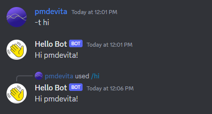

# Making A First Component

Atsume divides bot functionality into separate "components", which are modular units that are meant to contain a
single cohesive set of functionality for your bot. It could be a set of unrelated fun commands,
a game about collecting trading cards, or an application to track an external API and alert users.

For this example component, let's start by making one that responds to some simple commands. We'll explore some
features of Tanjun and Hikari along the way.

## Setting up the component

To get started, we need to scaffold our new component.

```shell
python manage.py startapp basic
```

This should generate some new files, and our project folder should now look like this.

```
basic
 |- apps.py
 |- commands.py
 |- models.py
my_bot
 |- local.py
 |- settings.py
manage.py
```

We also need to configure our bot to load this new component when it starts. In your `settings.py` file, add
`"basic"` to the list.

```python
# settings.py

COMPONENTS = [
    "basic"
]

```

Now we're ready to write some commands!

## A first command

Let's write a hello world command to begin with. Atsume supports all valid Tanjun commands, so you
can also reference from the [Tanjun command docs](https://tanjun.cursed.solutions/usage/#declaring-commands).

In your `commands.py` file, add the following.

```python
# basic/commands.py

import atsume
import tanjun

@tanjun.as_message_command("hi", "hello", "hey", "howdy")
async def hello(ctx: atsume.Context) -> None:
    await ctx.respond(f"Hi {ctx.member.display_name}!")

```

Let's explain each line here:
- Our first line starts with an `@` symbol, making this a Python decorator. Tanjun uses decorators to create
commands out of functions you write. Here, we are asking Tanjun to make a message command that will call our function
whenever someone uses the command `hi`, `hello`, `hey`, or `howdy`.
- The second line is where we define our function. Tanjun commands always need to be async functions, and should always
have at least one parameter, the "context", which is abbreviated to `ctx`. We also use a type hint to tell Python this
is an {py:class}`atsume.Context` object.
- Finally, on the third line, we respond to the command by saying hi to the display name of the Discord server member
that used the command. As a general rule of them, functions that send data to Discord are coroutines and need to
be `await`ed.


:::{admonition} What is async?
:class: tip

If you've never seen the `async` or `await` keywords in Python, this might be your first time
using Python asyncio.

Let's say we write a Python application that downloads information from the internet. While it's downloading, your
Python application will have to wait for each chunk of data to arrive to perform its tasks. During this time,
your application comes to a complete stop and does nothing as it waits. This might be less than ideal, especially if
it needs to download a lot of files or perform other tasks in the meantime (and specifically for Discord, your bot
needs to be able to handle a lot of simultaneous tasks such as its heartbeat, the listening and handling of many events
simultaneously, scheduled tasks, etc.)

In async programming, we can "await" an IO-related task (sending or receiving data over the network, reading or
writing to a file, etc.), and allow the Python interpreter
to perform other tasks while we wait for that IO to complete. By doing this, our application can handle multiple IO
related tasks at once and improve performance and responsiveness.

Here, since we are telling Discord to send a message, that's network IO, so we'll need to `await` its completion.
You can find out what functions need to be awaited through the Tanjun and Hikari documentation, through PyCharm
and VSCode linting, and if nothing else, through error messages.
:::

Now we should be ready to start the bot with our command! Run `python manage.py run` and start the bot again.

In the Discord server you invited it to, give the commands a try.




## Slash commands and hybrid commands

Tanjun supports defining commands as both message and slash commands. Doing this
is as easy as adding the slash command decorator to our command.

```python
# basic/commands.py

import atsume
import tanjun

@tanjun.as_slash_command("hi", "The bot says hi.")
@tanjun.as_message_command("hi", "hello", "hey", "howdy")
async def hello(ctx: atsume.Context) -> None:
    await ctx.respond(f"Hi {ctx.member.display_name}!")

```

## Command arguments

Now that we've looked at defining basic commands, let's look at adding arguments to our commands.
Tanjun supports several ways of adding arguments to a command but in this tutorial, we'll look at
using type annotations to add them.

Tanjun supports two kinds of arguments, Positional and Optional arguments. Positional arguments
work based on position in the command (if you are coming from Discord.py, this is what you'll be
used to). Optional arguments are specified with a flag first and the value after,
like `--fruit pineapple`.

Here's our hi command with an additional positional argument. Note that our typing for this is
`Optional[Member]` (not to be confused with an Optional argument). This means the command can be
run without supplying this argument, and the default will be None.


```python
import atsume
import tanjun
from typing import Annotated, Optional
from tanjun.annotations import Member, Positional


@tanjun.annotations.with_annotated_args(follow_wrapped=True)
@tanjun.as_message_command("hi", "hello", "hey", "howdy")
@tanjun.as_slash_command("hi", "Bot says hi")
async def hello(ctx: atsume.Context, member: Annotated[Optional[Member], "The user to say hi to.", Positional()] = None):
    member = member if member else ctx.member
    await ctx.respond(f"Hi {member.display_name}!")

```
