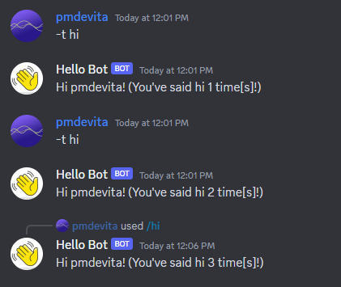

# Database Models and Queries

Atsume integrates the [Ormar](https://collerek.github.io/ormar/) library for handling 
database operations. Ormar is an ORM, so it works through defining your 
database tables in Python code and then performing queries with them.

Picking up where we left off, let's add a counter to our bot that counts how many 
times a user has said hi to it. 

## Creating a database model

Borrowing from the Django docs:

> A model is the single, definitive source of information about your data. It contains the essential fields and behaviors of the data you’re storing. Generally, each model maps to a single database table.

In Atsume, a component's models are stored in it's `models.py` file. Let's create the model we'll use 
to store how many times a user has said hello. You can find the Ormar docs on defining models 
[here](https://collerek.github.io/ormar/models/) (note that we are using the `Model` class from `atsume.db` 
rather than from `ormar`).

```python
# basic/models.py

from atsume.db import Model
import ormar


class HiCounter(Model):
    # Discord User IDs/snowflakes need to be stored as big integers
    # Autoincrement should be turned off if you do this
    user: int = ormar.BigInteger(primary_key=True, autoincrement=False)
    count: int = ormar.Integer(default=0)

```

Once we've defined our model, we need to add it to the database. We can do that automatically through Atsume's 
migrations. We'll cover them in more detail in the next section, for now run these two commands.

```shell
python manage.py makemigrations
python manage.py upgrade
```

This will generate the migration script (you'll see it appear in your component's `migrations` directory) and 
then run it on the database.

## Querying with a model

Now that we have a model, we can query it in our command. Let's update our command to use it!

```python
# basic/commands.py

@tanjun.annotations.with_annotated_args(follow_wrapped=True)
@tanjun.as_message_command("hi", "hello", "hey", "howdy")
@tanjun.as_slash_command("hi", "The bot says hi.")
async def hello(
    ctx: atsume.Context,
    member: Annotated[Optional[Member], "The user to say hi to.", Positional()] = None,
) -> None:
    member = member if member else ctx.member
    if member:
        # Get the entry in the database, or make a new one if there isn't one
        count_model, _ = await HiCounter.objects.get_or_create(
            user=member.user.id, _defaults={"count": 0}
        )
        count_model.count = count_model.count + 1
        await count_model.upsert()
        await ctx.respond(
            f"Hi {member.display_name}! (You've said hi {count_model.count} time[s]!)"
        )

```

Now when saying hello to the bot, it should look something like this.




